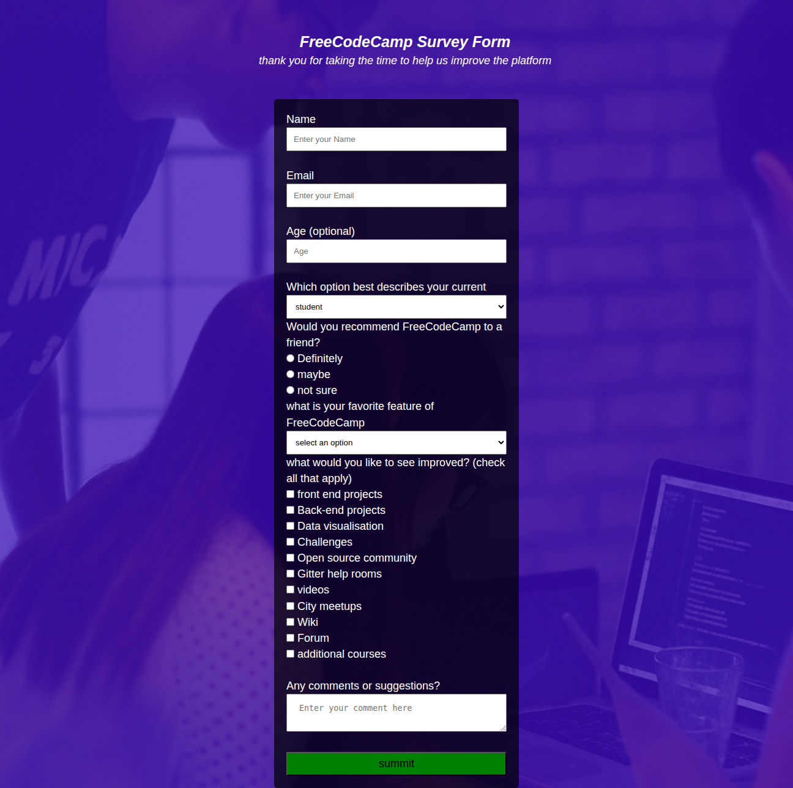

# freecodecamp survey form
preview
()
## about
this project is  survey form of freecodecamp to help  improve the platform and help  us to to do changes in what you like and others thank
## usage
open the form with any browser of choice
- fill in the requirement field

- select your preferred option

- add a comment 

- click submit when done

## Built using

HTML
CSS
* prerequisites
to work with or modify this project you should be able to understand the basic of HTML and style.CSS such as tags and input as show in my work 

## my link you can check and verify
https://dorian4563.github.io/survey-form/

